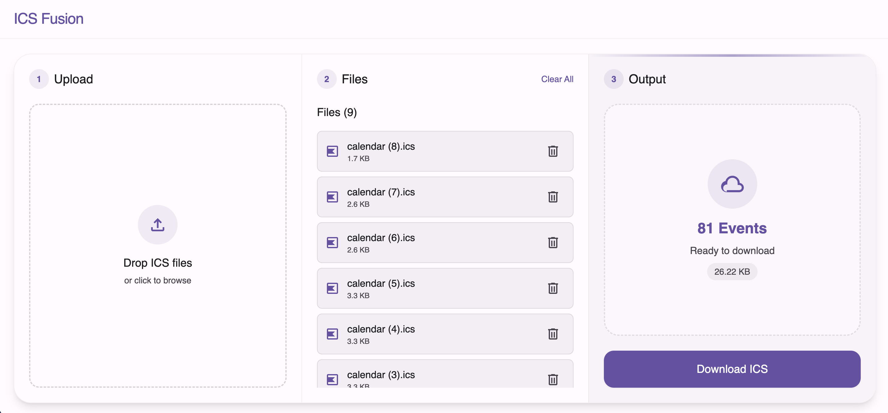

# ICS Fusion

**ICS Fusion** is a modern, client-side web application designed to merge multiple iCalendar (`.ics`) files into a single, consolidated calendar file. Built with **SolidJS**, **TypeScript**, and **Tailwind CSS**, it offers a seamless and responsive user experience with a clean Material Design 3 aesthetic.

[Link to the application](https://fabiopsh.github.io/ics-fusion/) - ICS Fusion

 <!-- Replace with actual screenshot if available -->

## Features

-  **Real-time Fusion**: Merges files instantly as you upload them.
-  **Drag & Drop**: Intuitive interface for adding multiple files at once.
-  **Privacy First**: All processing happens 100% in your browser. No data is sent to any server.
-  **Responsive Design**: Works perfectly on both desktop and mobile devices.
-  **Smart Preview**: View the event count and file size of your merged calendar before downloading.

## Tech Stack

-  [SolidJS](https://www.solidjs.com/) - Reactive UI library
-  [TypeScript](https://www.typescriptlang.org/) - Type safety
-  [Tailwind CSS](https://tailwindcss.com/) - Utility-first styling
-  [ical.js](https://github.com/mozilla-comm/ical.js/) - ICS parsing and handling
-  [Vite](https://vitejs.dev/) - Next Generation Frontend Tooling

## Getting Started

### Prerequisites

-  Node.js (v18 or higher)
-  npm

### Installation

1. Clone the repository:

   ```bash
   git clone https://github.com/your-username/ics-fusion.git
   cd ics-fusion
   ```

2. Install dependencies:

   ```bash
   npm install
   ```

3. Start the development server:

   ```bash
   npm run dev
   ```

4. Open your browser at `http://localhost:5173`.

## Usage

1. **Upload**: Drag and drop your `.ics` files into the left "Upload" column (or the top card on mobile).
2. **Review**: Check the file list in the middle column. You can remove individual files or clear all.
3. **Download**: The right column shows the live preview of your fused calendar. Click **Download ICS** to save the new file.

## License

This project is open-source and available under the MIT License.
